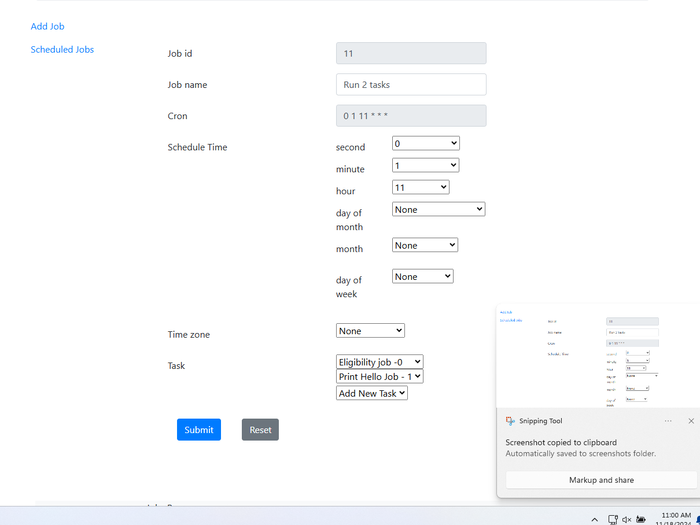
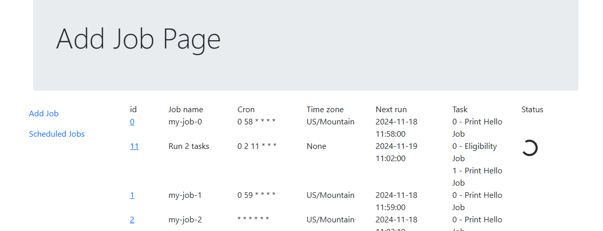

# Job Scheduling
## How to run
You can run this by running the `SchedulingTasksApplication` class in the project.

## Description of the project
This is a poc for demonstrating how a "job" can be configured and scheduled using Spring Scheduler as tasks.


The following is the `addjob` screen: .  A job can have multiple tasks to run.  The task have to be predefined.

The following is the `jobs` screen: 

I have setup a job to run as the picture shows :

This job is configured to run on the `0` second at `1` minute at `11` hour.
My computer clock is currently `11:00 AM` so it will run in less than 1 minute.

When the job runs the job is reflected on the `jobs` screen with a progress bar on the job 

The Job json holds all the data as shown in the `addjob` screen:
```java

public class Job {
    private String id;
    private String name;
    private String second;
    private String minute;
    private String hour;
    private String dayOfMonth;
    private String month;
    private String dayOfWeek;
    private String timeZone;
    private Map<Integer, String> taskMap = new HashMap<>();
    private String cronExpression;
    private String nextRun;
    private boolean running;
//getter/setter removed for brevity
}
```

The `Job` object is scheduled by encapsulating in a `JobRunner` which implements the `Runnable` interface.

